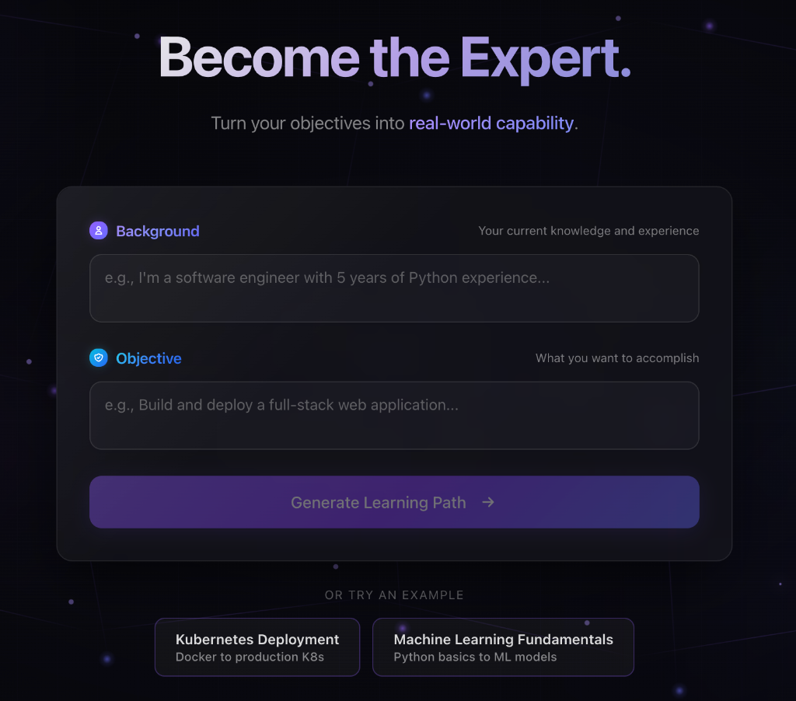
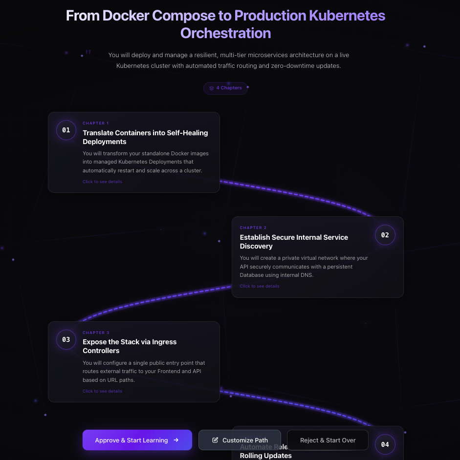
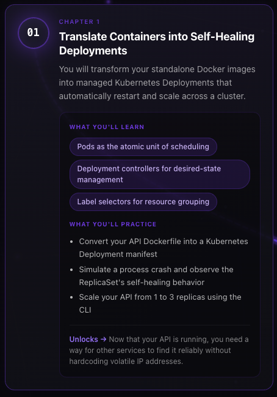
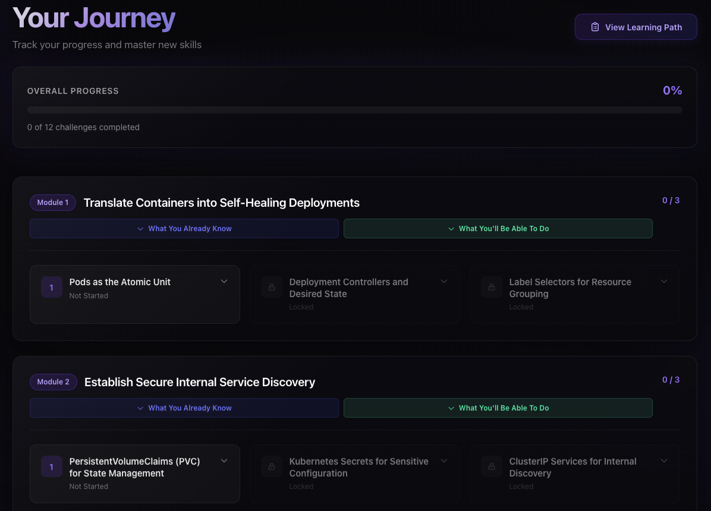
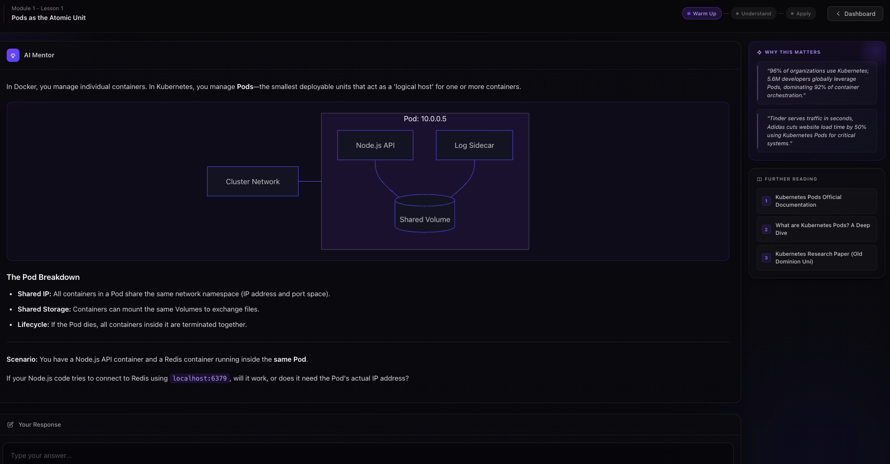

# Nebula
### The Adaptive Learning Operating System

Nebula is not just another learning platform; it's an intelligent engine that constructs a verified path from where you are today to where you want to be tomorrow. Whether you're mastering a new programming language, diving into system architecture, or upskilling for a promotion, Nebula is your personal AI architect.

---

### How It Works

1.  **Define Your Goal**: Tell Nebula exactly what you want to achieve (e.g., "Build a compiler in Rust").
2.  **Set Your Baseline**: Share your current skills so we know where to start.
3.  **Get Your Roadmap**: Receive a bespoke, module-by-module learning path.
4.  **Learn & Master**: Dive into interactive lessons that track your progress and acquired knowledge.

**Nebula: Your fast track to mastery.**

---

### See It In Action

#### Your Personalized Learning Path
A visual roadmap built around your specific goal—not a generic course catalog.

#### Chapter Breakdown
Each chapter shows exactly what you'll learn and what you'll practice. No fluff, just outcomes.

#### Progress Dashboard
Track your journey with clear progress indicators. See what's unlocked and what's next.

#### Interactive Lessons
Learn by doing. The AI Mentor guides you through concepts with diagrams, real scenarios, and questions that make you think—not answers handed to you.

---

### Why Nebula?

#### 🎯 100% Tailored to You
Forget generic "beginner" or "advanced" tracks. Nebula analyzes your unique background—what you already know and what you need to skip—to generate a **custom curriculum** specific to your goals. No wasted time on concepts you've already mastered.

#### 🧠 The Mastery Engine
We don't just show you content; we ensure you own it. Nebula uses a sophisticated **Mastery Engine** driven by the **URAC Framework** (Understand, Retain, Apply, Connect). It tracks your "acquired competencies" in real-time, ensuring every new lesson builds strictly on a solid foundation.
